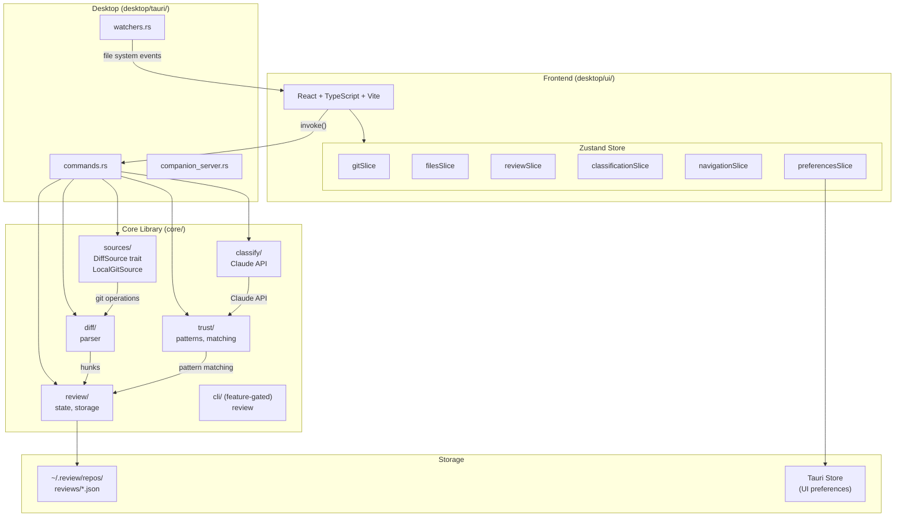

# CLAUDE.md

This file provides guidance to Claude Code (claude.ai/code) when working with code in this repository.

## Project Overview

Review is a desktop app (built with Tauri) that helps humans review diffs more efficiently. It classifies hunks (individual change blocks), enables bulk-approval of trivial changes, and focuses attention on what needs careful human review. It is **not** an AI code reviewer—it assists the review process.

## Development Commands

```bash
# Setup
scripts/install          # Install dependencies (npm + cargo + pre-commit hook)

# Desktop Development
scripts/dev              # Run in development mode with hot reload

# Testing
scripts/test             # TypeScript type check + Rust tests (fast, no API calls)

# Integration tests (require `claude` CLI, make real API calls, ~10s each)
cargo test -p review --test test_streaming -- --nocapture --ignored

# Linting/Formatting
scripts/fix              # Auto-fix: prettier + cargo fmt
scripts/pre-commit       # Check only: prettier --check + cargo fmt --check

# Build
scripts/build            # Build production app (outputs to target/release/)
```

## Architecture



The project is organized as a Cargo workspace with three top-level directories:

- **`core/`** — Core Rust library + CLI. All business logic, no Tauri dependencies.
- **`desktop/`** — Desktop app. Contains `tauri/` (Rust Tauri crate) and `ui/` (React frontend).
- **`ios/`** — Native SwiftUI companion app. Connects to the desktop companion server over HTTP.

Communication: the frontend calls Rust via Tauri's `invoke()`, commands defined in `desktop/tauri/src/desktop/commands.rs`. Data flows: Rust computes diffs/hunks → Zustand stores state → user actions invoke Rust → Rust persists to `~/.review/`.

## Key Concepts

- **Hunk**: A single block of changes in a diff, identified by `filepath:hash`
- **Trust Pattern**: Label from the taxonomy (e.g., `imports:added`, `formatting:whitespace`)
- **Trust List**: Patterns the user has chosen to auto-approve
- **Comparison**: The base..compare refs being reviewed

## Conventions

- **Error handling**: Rust uses `anyhow::Result`, Tauri commands return `Result<T, String>`, frontend uses try/catch on `invoke()`
- **Tauri IPC**: Commands defined in `commands.rs` as `#[tauri::command]` fns, called from frontend via `invoke("command_name", { args })`
- **API abstraction**: `desktop/ui/api/` provides an `ApiClient` interface; `tauri-client.ts` wraps `invoke()` calls, `http-client.ts` is for the companion server
- **Platform abstraction**: `desktop/ui/platform/` abstracts Tauri vs web (storage, file paths)

## Extending

The `DiffSource` trait abstracts over the source of diffs. Currently implemented:

- `LocalGitSource` - Local git repositories

Future implementations could include:

- `GitHubSource` - GitHub API for PRs
- `GitLabSource` - GitLab API for MRs
