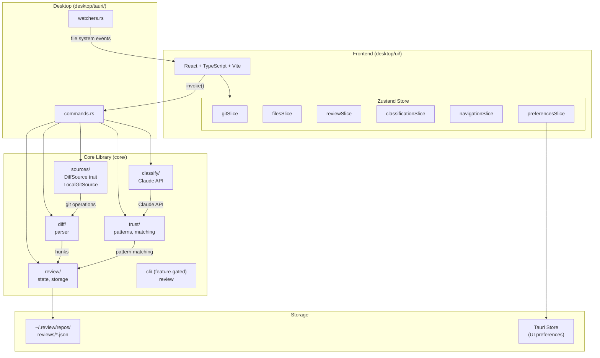

# CLAUDE.md

This file provides guidance to Claude Code (claude.ai/code) when working with code in this repository.

## Project Overview

Review is a desktop app (built with Tauri) that helps humans review diffs more efficiently. It classifies hunks (individual change blocks), enables bulk-approval of trivial changes, and focuses attention on what needs careful human review. It is **not** an AI code reviewer—it assists the review process.

## Development Commands

```bash
# Setup
scripts/install          # Install dependencies (npm + cargo + pre-commit hook)

# Desktop Development
scripts/dev              # Run in development mode with hot reload

# Web/Browser Development
scripts/dev-web          # Run UI in browser (Axum backend + Vite) — no Tauri needed

# Testing
scripts/test             # TypeScript type check + Rust tests (fast, no API calls)

# Linting/Formatting
scripts/fix              # Auto-fix: prettier + cargo fmt
scripts/pre-commit       # Check only: prettier --check + cargo fmt --check

# Build
scripts/build            # Build production app (outputs to target/release/)
```

## Architecture


```mermaid
graph TB
    subgraph Frontend["Frontend (desktop/ui/)"]
        React["React + TypeScript + Vite"]
        subgraph Zustand["Zustand Store"]
            gitSlice["gitSlice"]
            filesSlice["filesSlice"]
            reviewSlice["reviewSlice"]
            classificationSlice["classificationSlice"]
            navigationSlice["navigationSlice"]
            preferencesSlice["preferencesSlice"]
        end
        React --> Zustand
    end

    subgraph Desktop["Desktop (desktop/tauri/)"]
        commands["commands.rs"]
        watchers["watchers.rs"]
    end

    subgraph Core["Core Library (core/)"]
        sources["sources/
        DiffSource trait
        LocalGitSource"]
        diff["diff/
        parser"]
        review["review/
        state, storage"]
        trust["trust/
        patterns, matching"]
        classify["classify/
        Claude API"]
        cli["cli/ (feature-gated)
        review"]
    end

    subgraph Storage["Storage"]
        git_review["~/.review/repos/
        reviews/*.json"]
        tauri_store["Tauri Store
        (UI preferences)"]
    end

    React -->|"invoke()"| commands
    commands --> sources
    commands --> diff
    commands --> review
    commands --> trust
    commands --> classify
    watchers -->|"file system events"| React

    sources -->|"git operations"| diff
    diff -->|"hunks"| review
    trust -->|"pattern matching"| review
    classify -->|"Claude API"| trust

    review --> git_review
    preferencesSlice --> tauri_store
```

The project is organized as a Cargo workspace with three top-level directories:

- **`core/`** — Core Rust library + CLI. All business logic, no Tauri dependencies.
- **`desktop/`** — Desktop app. Contains `tauri/` (Rust Tauri crate) and `ui/` (React frontend).

Communication: the frontend calls Rust via Tauri's `invoke()`, commands defined in `desktop/tauri/src/desktop/commands.rs`. Data flows: Rust computes diffs/hunks → Zustand stores state → user actions invoke Rust → Rust persists to `~/.review/`.

### Web Mode

`scripts/dev-web` runs the UI in a regular browser (Chrome) with an Axum HTTP backend instead of Tauri. This is the preferred way to develop and test UI changes — you get full Chrome devtools, fast hot reload, and no Tauri rebuild cycle. The frontend uses an `HttpClient` (fetch-based) instead of `TauriClient` (invoke-based), both implementing the same `ApiClient` interface. Use web mode when working on the UI — open `localhost:1420` in Chrome to test.

## Key Concepts

- **Hunk**: A single block of changes in a diff, identified by `filepath:hash`
- **Trust Pattern**: Label from the taxonomy (e.g., `imports:added`, `formatting:whitespace`)
- **Trust List**: Patterns the user has chosen to auto-approve
- **Comparison**: The base..compare refs being reviewed

## The `review` CLI

The `review` binary (built with `--features cli`, source in `core/src/cli/`) is the terminal- and Claude-driven interface to a review. Two command families share `filepath:hash` hunk IDs.

**Review state** — reads/writes `~/.review/`; the desktop app's file watcher picks up CLI changes live, no reopen needed.

- `review hunks [-s base..head] [--status|--file|--label|--hunk] [--json] [--diff]`
- `review approve|reject|save|unmark <hunk-id>... [--reason TEXT]`
- `review status` · `review list [--all]` · `review delete` · `review change-base <new-base>`
- `review use [<spec>] [--clear]` — set/show the repo's default comparison. Every data command resolves its spec as `-s` flag → `$REVIEW_SPEC` → this default → auto-detect. `-s`/`--repo` are global (accepted in any position within a command).
- `review trust list|add|remove [<pattern>]`
- `review note show|set|append [<text>]`
- `review comments [--file GLOB] [--unresolved|--resolved] [--author NAME] [--json]`
- `review comments submit [FILE] [--author NAME] [--source ...] [--example]` — add many comments from a JSON array (stdin or FILE) in one write
- `review comment add <file>:<line>[:<end>] "<text>" [--side new|old|file] [--author NAME] [--source ui|cli|agent|github|gitlab]`
- `review comment edit|resolve|unresolve|delete <comment-id>`
- `review guide show [--json]` · `review guide add "<title>" <hunk-id>... [--desc TEXT]` · `review guide clear`

**Findings & runs** — the persistent record of an (AI) review pass. A `submit` records one run plus its findings; each finding carries an append-only disposition log (status is derived from the last event, not mutated).

- `review findings submit [FILE] [--source agent] [--example] [--dry-run] [--json]` — `--example` prints a JSON skeleton (no repo/writes); `--dry-run` validates and shows each finding's anchor resolution without persisting
- `review findings [--open|--resolved] [--kind K] [--severity S] [--run ID] [--file GLOB] [--json]`
- `review findings move --from <spec> --to <spec> [--run <id>]` — carry runs/findings onto another comparison, re-anchoring each finding (re-homes a working-diff review after a commit)
- `review finding show|resolve|reopen|delete <id>` — `resolve --as fixed|false-positive|accepted-risk|deferred`; `delete` drops a finding (cleanup, not disposition)
- `review runs [--json]` · `review runs delete <id> [--keep-findings]`

The **guide** is an agent-authored grouping of a comparison's hunks into a themed walkthrough. The desktop app renders it but no longer generates it — agents compose it via `review guide add` (each add lands live through the file watcher); `guide show` reconciles the stored groups against the current diff and reports any unplaced hunks as `ungrouped`.

**Git index** — stage individual hunks (the thing `git add` can't do non-interactively):

- `review changes [--staged|--unstaged|--file GLOB] [--json] [--diff]`
- `review stage|unstage <hunk-id|file>...`

**Skills**: `review skill install` writes the bundled skills into `~/.claude/skills/` and `$CODEX_HOME/skills/` (defaulting to `~/.codex/skills/`). Canonical sources live in `core/resources/skills/*/SKILL.md`, `include_str!`-embedded into the binary so the shipped CLI carries them:

- `review-guide` — reviewer-side: help a human work through a large diff.
- `pre-review` — submitter-side: run AI quality/bug-hunt passes at the end of a dev loop, fix or defer each finding with evidence, and persist the results as findings on a review run so the human starts from a record. The review note is human-only — agents read it, never write it.

Source layout: `mod.rs` (Cli, Commands enum, dispatch, comparison resolution shared with `review start`, `review use`); `common.rs` (`EffectiveStatus`, `mutate_review` retry, hunk-target parsing, spec-resolution precedence, `sync_classification`); `staging.rs`; `review_state.rs`; `comments.rs` (line-level comments / annotations + batch `comments submit`); `findings.rs` (runs, findings, `submit`/`move`/delete); `guide.rs` (guide grouping); `skill.rs`. Mutations use optimistic version-conflict retry against `~/.review/.../*.json`.

## Debugging / Traces

In dev mode (`scripts/dev`), Rust backend logs are written to `~/.review/app.log` via `tauri-plugin-log`. Frontend `console.*` calls are also written to this same file. This is disabled in release builds.

- `scripts/traces` — Print the full log file
- `scripts/traces -f` — Tail logs live while the app is running
- `scripts/traces -n 100` — Show last 100 lines

Key commands that include timing in their log output (look for `in <duration>`):

- `list_files` / `list_all_files` — Git file listing
- `get_all_hunks` — Git diff + hunk parsing (includes sub-timings for diff vs parse)
- `get_file_content` — Single file content + diff retrieval
- `get_file_symbol_diffs` / `get_repo_symbols` — Tree-sitter symbol extraction
- `classify_hunks_static` — Static hunk classification
- `detect_hunks_move_pairs` — Move pair detection
- `generate_hunk_grouping` — Claude API grouping call (slowest, typically 5-30s)
- `search_file_contents` — Git grep search

When adding new commands, include timing with `Instant::now()` / `t0.elapsed()` in the success log line to keep this pattern consistent.

## Conventions

- **Error handling**: Rust uses `anyhow::Result`, Tauri commands return `Result<T, String>`, frontend uses try/catch on `invoke()`
- **Tauri IPC**: Commands defined in `commands.rs` as `#[tauri::command]` fns, called from frontend via `invoke("command_name", { args })`
- **API abstraction**: `desktop/ui/api/` provides an `ApiClient` interface; `tauri-client.ts` wraps `invoke()` calls
- **Platform abstraction**: `desktop/ui/platform/` abstracts Tauri vs web (storage, file paths)

## Extending

The `DiffSource` trait abstracts over the source of diffs. Currently implemented:

- `LocalGitSource` - Local git repositories

Future implementations could include:

- `GitHubSource` - GitHub API for PRs
- `GitLabSource` - GitLab API for MRs
