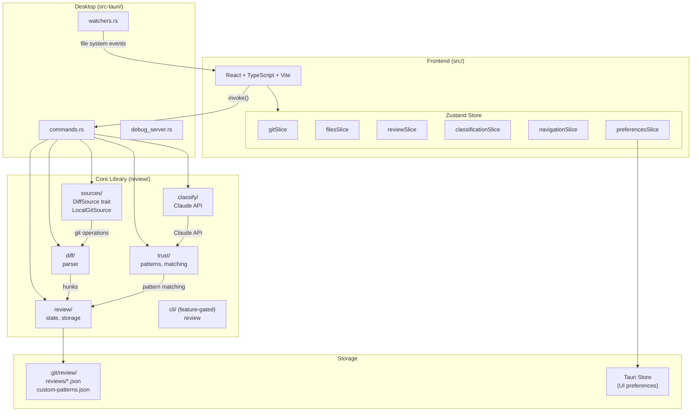

# Review

A desktop app that helps humans review diffs more efficiently.

## Features

### Local desktop app

Review runs as a native desktop app on your machine. It reads directly from your local git repo — no browser tabs, no network latency, no uploading diffs to a third party. File watchers reload automatically when your code changes on disk.

### Trust patterns

Classify hunks into categories like `imports:added` or `formatting:whitespace`, then build a trust list to auto-approve entire classes of trivial changes. Focus your attention on the hunks that actually need human review. The taxonomy is extensible with custom patterns per project.

### Multiple comparisons at once

Open the same repo in multiple tabs or windows, each with a different comparison (e.g. `main..feature-a` in one tab, `main..feature-b` in another). Each tab has its own independent review state. This isn't possible in most editors or web-based review tools.

### Read-only by design

Review is for reviewing, not editing. You can't modify code from inside the app — and that's the point. When most of the code is written by AI or teammates, your job shifts from writing to evaluating. Review is built for that: approve, reject, or annotate changes without the distraction of an editor.

### Symbol diffs

See which functions, classes, and methods are affected by each change, powered by tree-sitter. Navigate diffs at the symbol level instead of scrolling through raw line diffs. Supports 10+ languages.

## Development

### Prerequisites

- Node.js 18+
- Rust (latest stable)

### Setup

```bash
scripts/install
```

### Commands

```bash
scripts/install          # Install dependencies (npm + cargo + pre-commit hook)
scripts/dev              # Run in development mode with hot reload
scripts/test             # TypeScript type check + Rust tests
scripts/fix              # Auto-fix: prettier + cargo fmt
scripts/build            # Build production app
```

## Architecture



- **Frontend**: React + TypeScript + Vite (`src/`), state managed with Zustand
- **Backend**: Rust + Tauri (`src-tauri/`), classification via Claude CLI

## Key Concepts

- **Comparison** - What you're reviewing (working changes, staged, branch diff)
- **Hunk** - A block of changes, identified by `filepath:hash`
- **Trust Pattern** - A label like `imports:added` that can auto-approve hunks
- **Review State** - Persisted in `.git/review/reviews/`

## Extending

The `DiffSource` trait abstracts over the source of diffs. Currently implemented:

- `LocalGitSource` - Local git repositories

Future implementations could include:

- `GitHubSource` - GitHub API for PRs
- `GitLabSource` - GitLab API for MRs
