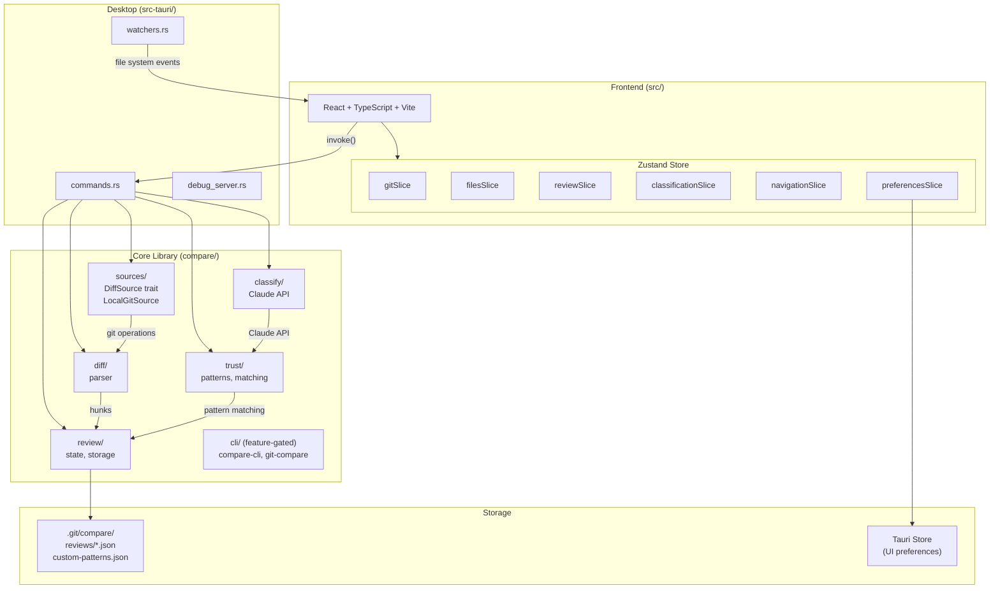

# Compare

A desktop app for reviewing code diffs with trust patterns and annotation support.

## Development

### Prerequisites

- Node.js 18+
- Rust (latest stable)

### Setup

```bash
scripts/install
```

### Commands

```bash
scripts/install          # Install dependencies (npm + cargo + pre-commit hook)
scripts/dev              # Run in development mode with hot reload
scripts/test             # TypeScript type check + Rust tests
scripts/fix              # Auto-fix: prettier + cargo fmt
scripts/build            # Build production app
```

## Architecture



- **Frontend**: React + TypeScript + Vite (`src/`), state managed with Zustand
- **Backend**: Rust + Tauri (`src-tauri/`), classification via Claude CLI

## Key Concepts

- **Comparison** - What you're reviewing (working changes, staged, branch diff)
- **Hunk** - A block of changes, identified by `filepath:hash`
- **Trust Pattern** - A label like `imports:added` that can auto-approve hunks
- **Review State** - Persisted in `.git/compare/reviews/`

## Extending

The `DiffSource` trait abstracts over the source of diffs. Currently implemented:

- `LocalGitSource` - Local git repositories

Future implementations could include:

- `GitHubSource` - GitHub API for PRs
- `GitLabSource` - GitLab API for MRs
